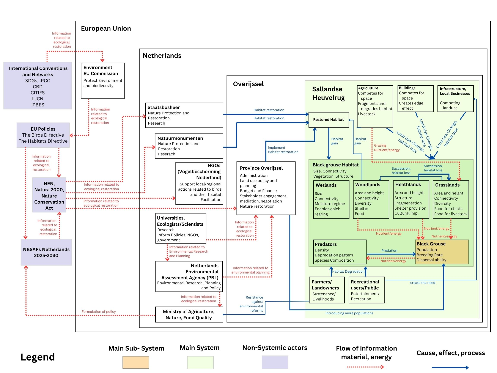
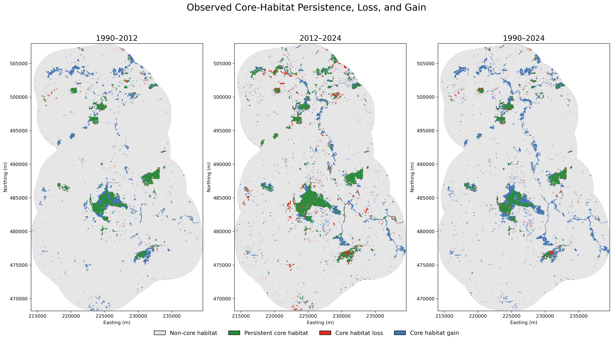
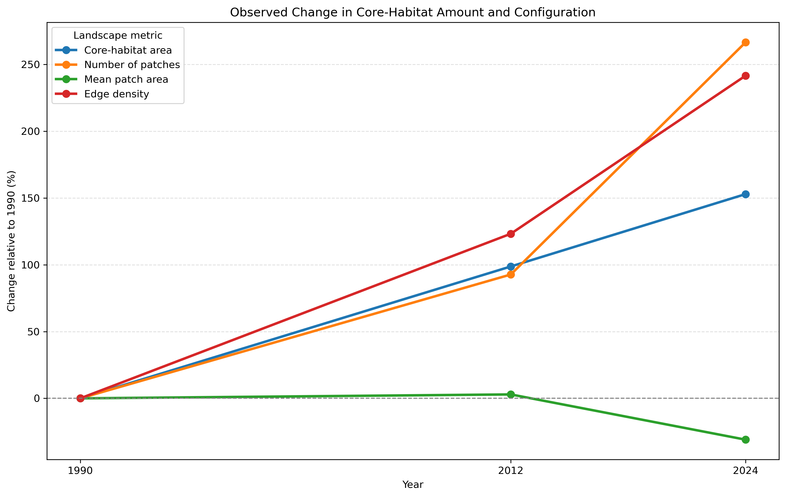
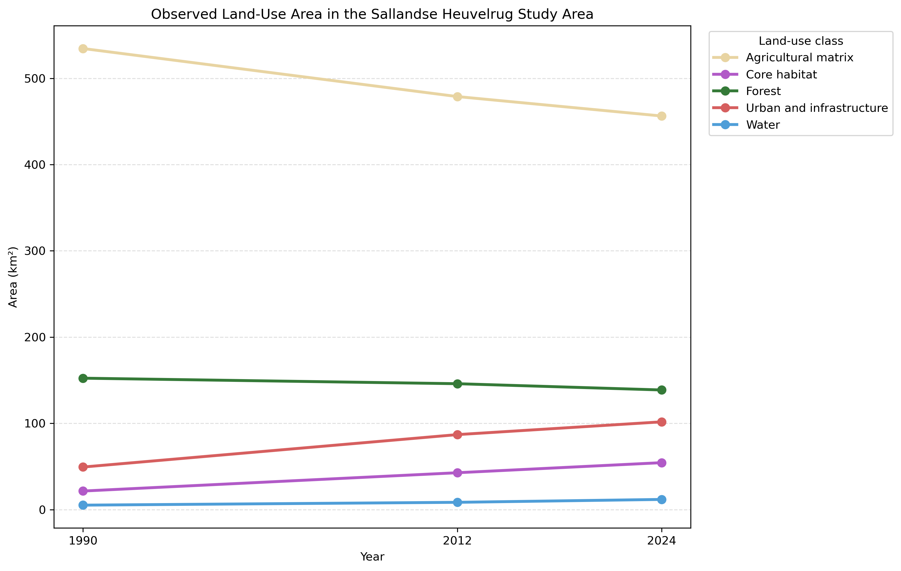
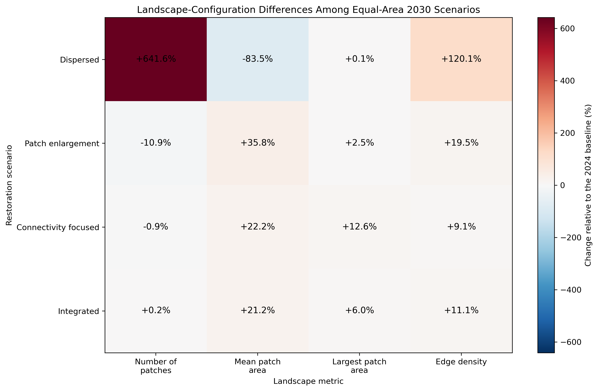
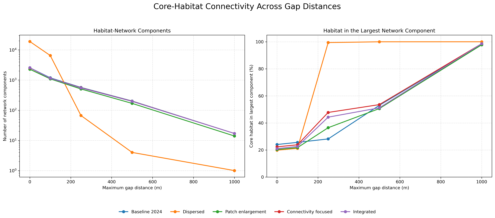
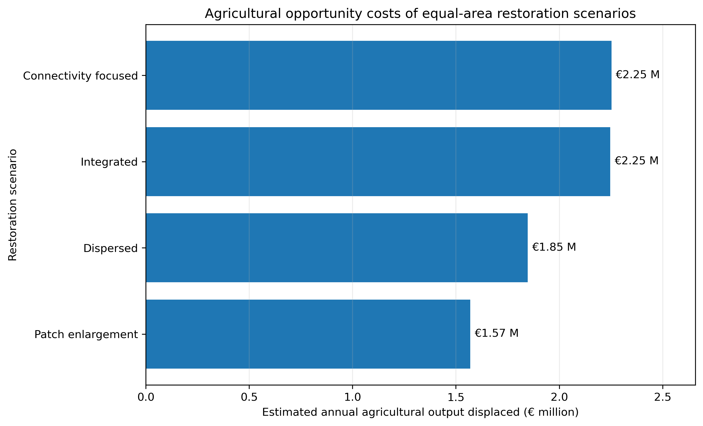
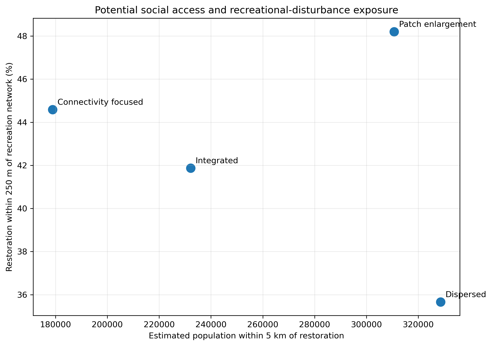
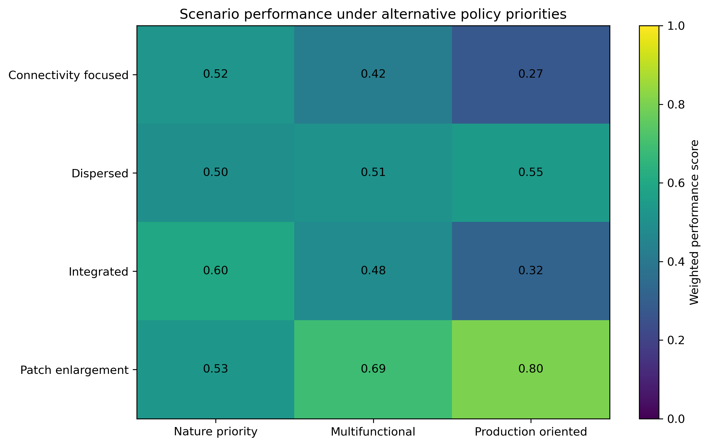
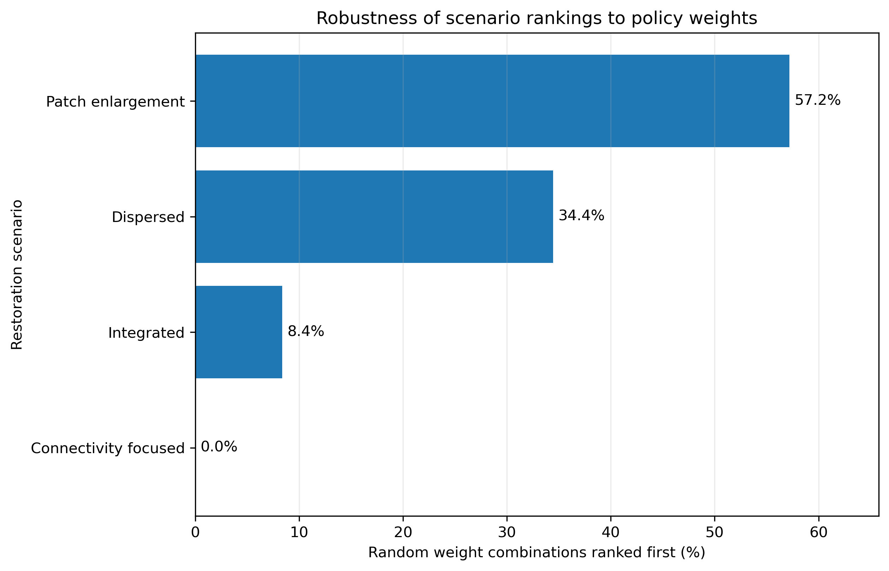

# Black Grouse Habitat Restoration Assessment under Alternative Land-Use Scenarios

A spatially explicit assessment of habitat restoration, landscape connectivity, agricultural opportunity costs, social accessibility and policy trade-offs in and around Sallandse Heuvelrug National Park, the Netherlands.

<p align="center">
  
</p>

<p align="center">
  <em>The 2024 land-use baseline and four equal-area habitat-restoration strategies evaluated for 2030.</em>
</p>

## Project overview

This Python/Jupyter project evaluates how alternative spatial allocations of habitat restoration influence ecological, economic and social outcomes.

The project combines:

- historical land-use change;
- habitat amount and fragmentation;
- habitat-network connectivity;
- spatial restoration suitability;
- agricultural opportunity costs;
- population accessibility and recreation;
- recreation-related disturbance exposure;
- multi-objective scenario assessment;
- policy-weight sensitivity analysis.

The ecological study area consists of Sallandse Heuvelrug National Park and a 5 km surrounding buffer, covering **762.88 km²**.

A larger social-analysis extent was created by adding a further 10 km buffer around the ecological study area.

## Problem statement

Black Grouse restoration in and around the Sallandse Heuvelrug cannot be
evaluated solely from the total area classified as habitat. Black Grouse
habitat use varies between seasons and life stages, while occurrence and
persistence are also associated with landscape-scale land-use patterns and
the availability of complementary habitat types (Baines, 1994; Ludwig et al.,
2009; Roos et al., 2016; Tost et al., 2022).

Habitat structure and management are particularly important during the
breeding period. Higher grazing intensity has been associated with shorter
vegetation, reduced vertical vegetation cover, lower invertebrate abundance
and lower Black Grouse breeding success. Young broods also show specific
associations with vegetation and habitat characteristics (Baines, 1996;
Roos et al., 2016).

Habitat loss, degradation and fragmentation caused by human land use are
recognised threats to grouse populations. Historical changes in farmland,
forest and settlement patterns have been associated with Black Grouse
occurrence and persistence, while habitat fragmentation may contribute to
isolation and genetic structuring among subpopulations (Storch, 2000;
Ludwig et al., 2009; Sittenthaler et al., 2018).

Recreation represents an additional potential pressure. GPS-tracking research
has shown that Black Grouse avoided areas close to public routes and that the
avoidance distance increased with the intensity of human activity
(Tost et al., 2020).

At the Sallandse Heuvelrug, restoration is undertaken within the Natura 2000
management context. Natuurmonumenten, Staatsbosbeheer and the Province of
Overijssel are directly involved in measures intended to conserve and
strengthen the area's natural habitats. These activities also sit within the
broader European nature-restoration policy framework
(Provincie Overijssel, n.d.; European Parliament & Council of the European
Union, 2024).

The conceptual diagram represents this broader ecological, land-use and
governance context. The quantitative analysis operationalises selected
components of the system by comparing habitat configuration, connectivity,
agricultural opportunity costs, potential population accessibility and
recreation-related disturbance exposure under alternative spatial restoration
scenarios.

<p align="center">
  
</p>

<p align="center">
  <em>Conceptual system map showing ecological processes, competing land uses, stakeholders, governance levels and information flows influencing Black Grouse habitat restoration in the Sallandse Heuvelrug.</em>
</p>

The spatial modelling workflow operationalises selected parts of this broader system by comparing how alternative restoration allocations affect habitat amount, fragmentation, connectivity, agricultural opportunity costs, potential social accessibility and recreation-related disturbance exposure.

## Research questions

1. How did land-use composition change between 1990, 2012 and 2024?
2. How did core-habitat amount, patch structure and fragmentation change during this period?
3. How do equal-area 2030 restoration strategies differ in landscape configuration and connectivity?
4. How much registered agricultural land and annual agricultural Standard Output would each strategy displace?
5. How do the scenarios differ in population accessibility, recreation-network proximity and disturbance exposure?
6. Which scenarios perform best under nature-priority, multifunctional and production-oriented policy contexts?
7. How robust are the scenario rankings when policy weights change?

## Study area and analytical settings

- **Study area:** Sallandse Heuvelrug National Park and a 5 km buffer
- **National park area:** 252.99 km²
- **Total ecological study area:** 762.88 km²
- **Coordinate reference system:** EPSG:28992
- **Ecological raster resolution:** 25 m
- **Social-analysis extension:** additional 10 km around the ecological study area

## Input datasets

### Land use and habitat

- **HGN1990**
- **LGN7, 2012**
- **LGN2024**

### Agricultural opportunity costs

- **BRP Gewaspercelen 2024 Definitief**
- **Standard Output 2020 coefficients**

### Population and recreation

- **CBS Vierkantstatistieken 100 m, 2024**
- **TOP10NL Wegdeel lijn**
- **TOP10NL Wegdeel vlak**

All spatial datasets were transformed to or analysed in **EPSG:28992**.

## Harmonised land-use classification

The HGN and LGN land-use classes were harmonised into five common categories:

| Value | Harmonised class |
|---:|---|
| 1 | Agricultural matrix |
| 2 | Core habitat |
| 3 | Forest |
| 4 | Urban and infrastructure |
| 5 | Water |

All three land-use datasets were aligned to the same 25 m raster grid and masked to an identical analysis extent.

## Workflow

| Notebook | Purpose |
|---|---|
| [`01_setup_and_inspect_data.ipynb`](01_setup_and_inspect_data.ipynb) | Inspect input datasets and create the ecological study-area buffer |
| [`02_harmonise_landuse.ipynb`](02_harmonise_landuse.ipynb) | Clip, align, reclassify, mask and validate land-use rasters |
| [`03_observed_landuse_change.ipynb`](03_observed_landuse_change.ipynb) | Analyse land-use transitions and habitat persistence, gain and loss |
| [`04_landscape_metrics.ipynb`](04_landscape_metrics.ipynb) | Calculate habitat amount and fragmentation metrics |
| [`05_restoration_suitability.ipynb`](05_restoration_suitability.ipynb) | Calculate restoration-suitability variables |
| [`06_simulate_2030_scenarios.ipynb`](06_simulate_2030_scenarios.ipynb) | Generate four equal-area restoration scenarios |
| [`07_connectivity_analysis.ipynb`](07_connectivity_analysis.ipynb) | Compare habitat-network connectivity across gap distances |
| [`08_compare_scenarios.ipynb`](08_compare_scenarios.ipynb) | Combine landscape, connectivity and suitability indicators |
| [`09_create_figures.ipynb`](09_create_figures.ipynb) | Produce ecological maps and figures |
| [`10_economic_opportunity_costs.ipynb`](10_economic_opportunity_costs.ipynb) | Estimate agricultural areas and Standard Output displaced |
| [`11_social_access_and_recreation.ipynb`](11_social_access_and_recreation.ipynb) | Evaluate population access, recreation proximity and disturbance exposure |
| [`12_multiobjective_assessment.ipynb`](12_multiobjective_assessment.ipynb) | Integrate ecological, economic, social and disturbance indicators |

---

# Part I — Historical landscape change

## Spatial land-use patterns

<p align="center">
  
</p>

<p align="center">
  <em>Harmonised land-use patterns in 1990, 2012 and 2024.</em>
</p>

Core-habitat area increased throughout the study period:

| Year | Core-habitat area | Percentage of study area |
|---:|---:|---:|
| 1990 | 21.51 km² | 2.82% |
| 2012 | 42.75 km² | 5.60% |
| 2024 | 54.41 km² | 7.13% |

Between 1990 and 2024:

- core-habitat area increased by **32.90 km²**;
- agricultural matrix decreased by **78.24 km²**;
- urban and infrastructure increased by **52.40 km²**;
- forest decreased by **13.67 km²**.

## Core-habitat persistence, loss and gain

<p align="center">
  
</p>

<p align="center">
  <em>Spatial persistence, loss and gain of the harmonised core-habitat category.</em>
</p>

Of the 1990 core habitat:

- **17.44 km²** persisted until 2024;
- **4.07 km²** was lost;
- **36.97 km²** of new core habitat was identified in 2024.

## Habitat amount and fragmentation

<p align="center">
  
</p>

<p align="center">
  <em>Percentage change in habitat amount and configuration relative to the 1990 baseline.</em>
</p>

Although core-habitat area increased, habitat configuration became more fragmented.

| Metric | 1990 | 2012 | 2024 |
|---|---:|---:|---:|
| Core-habitat area | 21.512 km² | 42.752 km² | 54.408 km² |
| Number of patches | 701 | 1,351 | 2,570 |
| Mean patch area | 0.0307 km² | 0.0316 km² | 0.0212 km² |
| Largest patch area | 6.597 km² | 11.136 km² | 13.093 km² |
| Edge density | 5.747 m/ha | 12.829 m/ha | 19.632 m/ha |

From 1990 to 2024:

- core-habitat area increased by **152.92%**;
- patch number increased by **266.62%**;
- mean patch area decreased by **30.94%**;
- edge density increased by **241.60%**.

The results show that habitat expansion occurred together with increasing subdivision and edge exposure.

<details>
<summary><strong>Supporting figure: observed land-use area by class</strong></summary>

<br>

<p align="center">
  
</p>

<p align="center">
  <em>Changes in the total area of the five harmonised land-use classes.</em>
</p>

</details>

---

# Part II — Restoration suitability and 2030 scenarios

## Restoration suitability

Restoration candidates were restricted to agricultural-matrix pixels in the 2024 land-use raster.

The suitability assessment combined:

- proximity to existing core habitat;
- distance from urban areas and infrastructure;
- surrounding core-habitat proportion within 1 km;
- surrounding urban proportion within 1 km.

The four components were standardised between 0 and 1 and combined using equal weights.

## Equal-area restoration scenarios

Each scenario restored exactly:

- **18,649 pixels**
- **11.656 km²**
- approximately **1,165.6 ha**

All scenarios therefore contain the same total 2030 core-habitat area:

- **66.063 km²**

The four strategies were:

### Dispersed restoration

Restoration pixels were selected randomly across the eligible agricultural matrix, representing spatially uncoordinated restoration.

### Patch enlargement

Pixels near existing core habitat were prioritised, representing restoration around existing habitat boundaries.

### Connectivity-focused restoration

Candidate pixels situated in potential gaps between existing habitat patches were prioritised.

### Integrated low-matrix-pressure restoration

Pixels were selected using the combined restoration-suitability score, balancing proximity to core habitat, surrounding habitat amount, distance from urban areas and low surrounding urban pressure.

## Spatial comparison of the scenarios

<p align="center">
  
</p>

<p align="center">
  <em>The 2024 baseline and four equal-area 2030 restoration allocations.</em>
</p>

## Landscape-configuration effects

<p align="center">
  
</p>

<p align="center">
  <em>Percentage change in landscape metrics relative to the 2024 baseline.</em>
</p>

| Scenario | Patches | Mean patch area | Largest patch | Edge density |
|---|---:|---:|---:|---:|
| Baseline 2024 | 2,570 | 0.0212 km² | 13.093 km² | 19.632 m/ha |
| Dispersed | 19,058 | 0.0035 km² | 13.101 km² | 43.210 m/ha |
| Patch enlargement | 2,290 | 0.0288 km² | 13.418 km² | 23.461 m/ha |
| Connectivity focused | 2,546 | 0.0259 km² | 14.749 km² | 21.411 m/ha |
| Integrated | 2,574 | 0.0257 km² | 13.878 km² | 21.820 m/ha |

- **Dispersed restoration** produces the greatest fragmentation and edge exposure.
- **Patch enlargement** produces the fewest patches and largest mean patch area.
- **Connectivity-focused restoration** produces the largest individual habitat patch.
- **Integrated restoration** produces the highest mean restoration suitability and greatest mean distance from urban infrastructure.

## Habitat-network connectivity

<p align="center">
  
</p>

<p align="center">
  <em>Habitat-network components and the percentage of habitat contained in the largest network component across alternative gap-distance assumptions.</em>
</p>

Connectivity was assessed using maximum gap distances of:

- 0 m;
- 100 m;
- 250 m;
- 500 m;
- 1,000 m.

The dispersed scenario appears highly connected at larger gap thresholds because numerous small restoration pixels function as stepping stones. However, it simultaneously produces very high patch numbers, very small mean patch size and high edge density.

Connectivity must therefore be interpreted together with habitat configuration and assumptions about species movement.

---

# Part III — Agricultural opportunity costs

The restoration masks were intersected with BRP 2024 agricultural parcels.

Affected crop areas were combined with crop-specific, related-crop and category-level Standard Output coefficients to estimate the annual agricultural output displaced by each restoration strategy.

<p align="center">
  
</p>

<p align="center">
  <em>Estimated annual agricultural Standard Output displaced by each equal-area restoration scenario.</em>
</p>

| Rank: lowest cost | Scenario | BRP coverage | Annual output displaced | Output displaced per restored ha |
|---:|---|---:|---:|---:|
| 1 | Patch enlargement | 77.75% | €1,569,796.56 | €1,346.81/ha |
| 2 | Dispersed | 87.68% | €1,847,400.57 | €1,584.99/ha |
| 3 | Integrated | 92.32% | €2,246,921.42 | €1,927.76/ha |
| 4 | Connectivity focused | 84.87% | €2,252,302.79 | €1,932.37/ha |

**Patch enlargement** has the lowest estimated agricultural opportunity cost.

**Connectivity-focused restoration** has the highest estimated opportunity cost, although the integrated strategy is almost equally costly.

Standard Output represents standardised agricultural production value. It is not equivalent to land price, farm profit, compensation cost or total economic welfare loss.

---

# Part IV — Social accessibility and recreation

CBS 100 m population cells were used to estimate the number of residents living near restoration.

TOP10NL walking and cycling infrastructure was used to calculate proximity to recreation networks and potential recreation-related disturbance exposure.

<p align="center">
  
</p>

<p align="center">
  <em>Trade-off between nearby population exposure and the percentage of restored land situated within 250 m of mapped recreation infrastructure.</em>
</p>

| Scenario | Population within 5 km | Restoration within 500 m of recreation network | Restoration within 250 m of recreation network |
|---|---:|---:|---:|
| Dispersed | 328,588 | 65.94% | 35.66% |
| Patch enlargement | 310,671 | 77.90% | 48.20% |
| Connectivity focused | 178,859 | 79.04% | 44.59% |
| Integrated | 232,153 | 76.52% | 41.87% |

Interpretation:

- **Dispersed restoration** reaches the largest nearby population and has the lowest close-range recreation exposure.
- **Patch enlargement** combines high population access with strong recreation-network proximity, but also has the highest potential disturbance exposure.
- **Connectivity-focused restoration** has the greatest share of restoration within 500 m of recreation infrastructure, but reaches the smallest population.
- **Integrated restoration** occupies an intermediate position.

These indicators represent **potential accessibility and potential disturbance exposure**, not confirmed public access, actual visitor intensity or observed disturbance.

---

# Part V — Multi-objective scenario assessment

## Standardised dimension scores

Indicators were standardised from 0 to 1 so that higher values consistently represent better performance.

| Scenario | Ecological | Economic | Social access | Low disturbance |
|---|---:|---:|---:|---:|
| Dispersed | 0.2500 | 0.5933 | 0.5000 | 1.0000 |
| Patch enlargement | 0.6163 | 1.0000 | 0.8967 | 0.0000 |
| Connectivity focused | 0.7258 | 0.0000 | 0.5000 | 0.2879 |
| Integrated | 0.7456 | 0.0079 | 0.5818 | 0.5048 |

## Alternative policy priorities

<p align="center">
  
</p>

<p align="center">
  <em>Weighted performance of the restoration scenarios under nature-priority, multifunctional and production-oriented policy contexts.</em>
</p>

| Scenario | Nature priority | Multifunctional | Production oriented |
|---|---:|---:|---:|
| Connectivity focused | 3 | 4 | 4 |
| Dispersed | 4 | 2 | 2 |
| Integrated | 1 | 3 | 3 |
| Patch enlargement | 2 | 1 | 1 |

- **Integrated restoration** ranks first under nature-priority weighting.
- **Patch enlargement** ranks first under multifunctional and production-oriented priorities.
- **Dispersed restoration** ranks second under multifunctional and production-oriented priorities.
- **Connectivity-focused restoration** performs strongly ecologically but is constrained by its high agricultural opportunity cost.

## Weight-sensitivity analysis

Scenario robustness was tested using **10,000 random policy-weight combinations**.

<p align="center">
  
</p>

<p align="center">
  <em>Percentage of random policy-weight combinations under which each scenario ranked first.</em>
</p>

| Scenario | First-place frequency | Mean simulated rank | Top-two frequency |
|---|---:|---:|---:|
| Patch enlargement | 57.20% | 1.78 | 76.09% |
| Dispersed | 34.44% | 2.08 | 74.47% |
| Integrated | 8.36% | 2.46 | 46.06% |
| Connectivity focused | 0.00% | 3.68 | 3.38% |

**Patch enlargement** is the most robust overall strategy across changing policy weights.

**Integrated restoration** becomes preferred when ecological performance receives dominant weight.

**Connectivity-focused restoration** does not rank first in the random-weight assessment because its ecological strengths are offset by its economic and social-access performance.

---

# Main conclusion

The project demonstrates that habitat-restoration planning cannot be evaluated using habitat area alone.

Historical habitat expansion occurred together with increasing fragmentation. The four equal-area 2030 scenarios also produced substantially different habitat configurations, connectivity outcomes, agricultural opportunity costs, accessibility benefits and disturbance exposure.

The preferred strategy depends on policy priorities:

- **Integrated restoration** performs best under nature-priority weighting.
- **Patch enlargement** is the strongest multifunctional and production-oriented strategy and the most robust across random policy weights.
- **Dispersed restoration** provides high population accessibility and low close-range recreation exposure but produces poor habitat configuration.
- **Connectivity-focused restoration** provides strong ecological connectivity outcomes but has the highest estimated agricultural opportunity cost.

The results support spatially explicit, multi-objective restoration planning that evaluates ecological outcomes, economic trade-offs, social accessibility and conservation disturbance together.

## Key outputs

### Integrated assessment

- [Final multi-objective scenario assessment](outputs/tables/final_multiobjective_scenario_assessment.csv)
- [Policy-context rankings](outputs/tables/scenario_policy_context_rankings.csv)
- [Weight-sensitivity analysis](outputs/tables/scenario_weight_sensitivity.csv)
- [Standardised dimension scores](outputs/tables/scenario_dimension_scores.csv)

### Ecological assessment

- [Complete ecological scenario comparison](outputs/tables/2030_scenario_comparison_complete.csv)
- [Scenario landscape metrics](outputs/tables/2030_scenario_landscape_metrics.csv)
- [Connectivity across gap distances](outputs/tables/core_habitat_connectivity_by_gap_distance.csv)

### Economic assessment

- [Agricultural opportunity-cost results](outputs/tables/scenario_agricultural_opportunity_costs.csv)
- [Economic scenario ranking](outputs/tables/scenario_economic_cost_ranking.csv)
- [Restoration area by crop and Standard Output](outputs/tables/restoration_area_by_crop_with_so.csv)
- [BRP coverage summary](outputs/tables/restoration_brp_coverage_summary.csv)

### Social assessment

- [Social-access and recreation summary](outputs/tables/scenario_social_access_recreation_summary.csv)

## Repository structure

```text
black-grouse-habitat-restoration-assessment/
│
├── data/
│   └── README.md
│
├── outputs/
│   ├── figures/
│   └── tables/
│
├── 01_setup_and_inspect_data.ipynb
├── 02_harmonise_landuse.ipynb
├── 03_observed_landuse_change.ipynb
├── 04_landscape_metrics.ipynb
├── 05_restoration_suitability.ipynb
├── 06_simulate_2030_scenarios.ipynb
├── 07_connectivity_analysis.ipynb
├── 08_compare_scenarios.ipynb
├── 09_create_figures.ipynb
├── 10_economic_opportunity_costs.ipynb
├── 11_social_access_and_recreation.ipynb
├── 12_multiobjective_assessment.ipynb
├── requirements.txt
├── LICENSE
└── README.md
```

## Reproducibility

Run notebooks sequentially from `01` to `12`.

- Notebooks `01–09` generate the ecological baseline, restoration scenarios and ecological indicators.
- Notebook `10` estimates agricultural opportunity costs.
- Notebook `11` calculates population accessibility, recreation proximity and disturbance exposure.
- Notebook `12` integrates all indicators and performs policy-weight and sensitivity analyses.

The dispersed scenario uses a fixed random seed of `42`.

The weight-sensitivity analysis also uses a fixed random seed of `42`.

Required Python packages are listed in [`requirements.txt`](requirements.txt).

## Data availability

The complete HGN, LGN, BRP, CBS and TOP10NL datasets are not redistributed through this repository because of file size, licensing conditions and external distribution arrangements.

Dataset requirements and preparation details are documented in [`data/README.md`](data/README.md).

## Limitations

- The scenarios represent spatial restoration alternatives rather than predictions of future land-use change.
- The harmonised core-habitat category is a landscape-scale habitat proxy rather than a direct measurement of Black Grouse occupancy or habitat quality.
- Restoration suitability does not include field-measured vegetation structure, management intensity or Black Grouse demographic data.
- Connectivity results depend on the selected gap-distance assumptions.
- Small habitat pixels may not function as viable habitat patches in practice.
- BRP does not cover every restored pixel.
- Standard Output is not equivalent to land price, compensation cost, farm profit or complete welfare loss.
- Population accessibility is based on Euclidean distance rather than network travel time.
- TOP10NL does not fully capture local access restrictions, seasonal closures, visitor intensity or actual disturbance.
- Multi-objective rankings depend on indicator selection, standardisation and policy weights.

## Licence

The original Python and Jupyter workflow is available under the MIT License.

Third-party datasets remain subject to the licences and terms of their respective providers and are not redistributed under the repository licence.

## References

Baines, D. (1994). Seasonal differences in habitat selection by black grouse
*Tetrao tetrix* in the northern Pennines, England. *Ibis, 136*(1), 39–43.
https://doi.org/10.1111/j.1474-919X.1994.tb08129.x

Baines, D. (1996). The implications of grazing and predator management on
the habitats and breeding success of black grouse *Tetrao tetrix*.
*Journal of Applied Ecology, 33*(1), 54–62.
https://doi.org/10.2307/2405015

Ludwig, T., Storch, I., & Graf, R. F. (2009). Historic landscape change and
habitat loss: The case of black grouse in Lower Saxony, Germany.
*Landscape Ecology, 24*(4), 533–546.
https://doi.org/10.1007/s10980-009-9330-3

Roos, S., Donald, C., Dugan, D., Hancock, M. H., O’Hara, D., Stephen, L.,
& Grant, M. (2016). Habitat associations of young black grouse
*Tetrao tetrix* broods. *Bird Study, 63*(2), 203–213.
https://doi.org/10.1080/00063657.2016.1141167

Sittenthaler, M., Kunz, F., Szymusik, A., Grünschachner-Berger, V.,
Krumböck, S., Stauffer, C., & Nopp-Mayr, U. (2018). Fine-scale genetic
structure in an eastern Alpine black grouse *Tetrao tetrix* metapopulation.
*Journal of Avian Biology, 49*(5), e01681.
https://doi.org/10.1111/jav.01681

Storch, I. (2000). Conservation status and threats to grouse worldwide:
An overview. *Wildlife Biology, 6*(4), 195–204.
https://doi.org/10.2981/wlb.2000.016

Tost, D., Strauß, E., Jung, K., & Siebert, U. (2020). Impact of tourism on
habitat use of black grouse (*Tetrao tetrix*) in an isolated population in
northern Germany. *PLOS ONE, 15*(9), e0238660.
https://doi.org/10.1371/journal.pone.0238660

Tost, D., Ludwig, T., Strauss, E., Jung, K., & Siebert, U. (2022). Habitat
selection of black grouse in an isolated population in northern Germany—The
importance of mixing dry and wet habitats. *PeerJ, 10*, e14161.
https://doi.org/10.7717/peerj.14161

European Parliament & Council of the European Union. (2024). Regulation
(EU) 2024/1991 of the European Parliament and of the Council of 24 June
2024 on nature restoration and amending Regulation (EU) 2022/869.
*Official Journal of the European Union*.
https://eur-lex.europa.eu/legal-content/EN/TXT/?uri=CELEX:32024R1991

Provincie Overijssel. (n.d.). *Sallandse Heuvelrug (Natura 2000)*.
https://www.overijssel.nl/sallandseheuvelrug